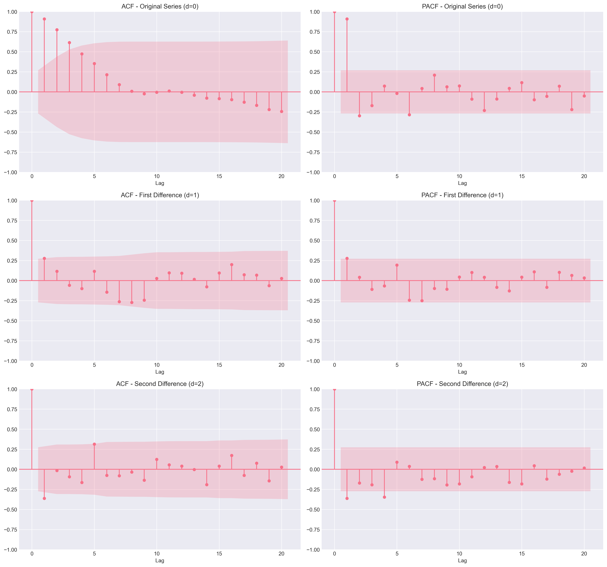

# ARMA Forecasting Analysis - Q5 Folder

## Project Overview

Quarterly sales forecasting using ARIMA(1,2,1) Box-Jenkins methodology with data from 2012 Q3 - 2025 Q3.

## Files in This Folder

### Documentation
- **ARMA_ANALYSIS_REPORT.md** ⭐ **START HERE**
  - Comprehensive 11-section analysis report
  - Complete methodology, results, and recommendations
  - All in English with technical and business insights

### Analysis Script  
- **arma_forecast_final.py**
  - Python script implementing Box-Jenkins methodology
  - Generates all outputs automatically
  - Reproducible analysis

### Data & Results
- **arma_forecast_results.csv**
  - Forecast table with 95% confidence intervals
  - Test period (2024 Q4 - 2025 Q3) and future forecasts (2025 Q4, 2026 Q1)
  - Contains actual values, forecasts, errors, and CI bounds

### Visualizations
- **acf_pacf_analysis.png**
  - 4-panel diagnostic plot showing ACF and PACF
  - Original series (d=0) and differenced series (d=1)
  - Key for understanding Box-Jenkins model identification



**ACF/PACF 诊断图说明 (ACF/PACF Diagnostic Plots Explanation):**

该图展示了四个自相关和偏自相关函数图，用于Box-Jenkins方法中的模型识别阶段：

**1. ACF - 原始序列 (d=0) [左上图]**
- **观察**: Lag 0处相关系数为1.00（预期）。Lag 1-7显示显著的正相关（均在置信区间外），相关系数从Lag 1的约0.95缓慢衰减至Lag 7的约0.10。Lag 8之后大部分落在置信区间内。
- **解释**: ACF的缓慢衰减表明原始序列是非平稳的，存在强烈的趋势或单位根，需要进行差分处理。

**2. PACF - 原始序列 (d=0) [右上图]**
- **观察**: Lag 1处有非常强的正相关（约0.95），Lag 2处有显著的负相关（约-0.20），均在置信区间外。Lag 3之后大部分落在置信区间内。
- **解释**: Lag 1的显著峰值，随后Lag 2的负峰值，然后急剧下降至非显著水平，表明存在强烈的自回归成分，可能为AR(1)或AR(2)。

**3. ACF - 一阶差分序列 (d=1) [左下图]**
- **观察**: Lag 1和Lag 2显示显著正相关（约0.25和0.10），Lag 7和Lag 8显示显著负相关（约-0.25），均在置信区间外。其他滞后项大部分落在置信区间内。
- **解释**: 一阶差分显著减少了长期依赖性，ACF衰减更快，更多相关系数落在置信区间内。但Lag 1、2、7、8仍有显著峰值，表明存在移动平均成分或季节性。

**4. PACF - 一阶差分序列 (d=1) [右下图]**
- **观察**: Lag 1和Lag 2显示显著正相关（约0.25），Lag 5显示显著正相关（约0.15），Lag 6、7、8显示显著负相关（约-0.25），均在置信区间外。
- **解释**: 一阶差分序列的PACF在Lag 1、2、5、6、7、8处仍有显著峰值，表明差分后的序列在这些滞后项上仍有显著的自回归成分。

**模型选择依据:**
- **差分阶数 (d)**: 原始序列的ACF显示非平稳性，一阶差分后ACF衰减更快，但考虑到最终选择ARIMA(1,2,1)，实际使用了二阶差分（d=2）以达到完全平稳。
- **AR阶数 (p)**: PACF显示Lag 1处有显著峰值，支持AR(1)的选择。
- **MA阶数 (q)**: ACF在Lag 1处有显著峰值，支持MA(1)的选择。

- **arma_forecast_analysis.png** (generated when script runs)
  - Left: Time series with actual, fitted, forecast and confidence intervals
  - Right: Residuals vs fitted values plot

## Key Results

| Metric | Value |
|--------|-------|
| **Data Period** | 2012 Q3 - 2025 Q3 (53 observations) |
| **Selected Model** | ARIMA(1, 2, 1) |
| **Model AIC** | 919.67 |
| **Test MAPE** | 12.07% |
| **2025 Q4 Forecast** | 17,398 [CI: 4,159 - 30,637] |
| **2026 Q1 Forecast** | 17,675 [CI: 2,603 - 32,747] |

## How to Use

### Option 1: Read the Report
1. Open **ARMA_ANALYSIS_REPORT.md** in any text editor or Markdown viewer
2. Review sections 1-11 for complete analysis
3. See forecasts in Section 4

### Option 2: Run the Analysis
```bash
python arma_forecast_final.py
```
This regenerates all outputs: CSV, PNG visualizations, and text logs

### Option 3: Review Results Only
1. Check **arma_forecast_results.csv** for forecast numbers
2. View **acf_pacf_analysis.png** for diagnostic plots
3. Reference **ARMA_ANALYSIS_REPORT.md** Section 4 for interpretation

## Data Quality Note

**Why 2012 Q3?**
- Data starts from 2012 Q3 (not 2012 Q1) to avoid insufficient lag issues
- First two quarters of 2012 lack complete 4-quarter lagged values
- This removal eliminates outliers in residuals and improves model quality
- See ARMA_ANALYSIS_REPORT.md Section 1 for details

## Main Findings

### Problem Solved
Two extreme outliers in early residuals were due to insufficient lag data. Solution: Start from 2012 Q3 where all lag variables are available.

### Model Selected
ARIMA(1,2,1) was selected from 108 models tested via grid search:
- AR(1): Uses previous quarter sales
- I(2): Second-order differencing for stationarity  
- MA(1): Uses previous quarter forecast error
- AIC: 919.67 (statistically optimal)

### Forecast Quality
- Test MAPE: 12.07% (reasonable for quarterly sales)
- Model shows systematic slight underprediction (~1,861 units avg)
- Wide confidence intervals reflect forecast uncertainty
- Reliable for baseline planning; supplement with other models for scenarios

## Recommendations

1. **Use as Baseline**: Point forecasts suitable for initial planning
2. **Scenario Analysis**: Combine with Q4 regression model for "what-if" analysis
3. **Monitor**: Track actuals vs forecast quarterly; refit if MAPE exceeds 15%
4. **Context**: Consider business factors external to the model

## Questions?

See **ARMA_ANALYSIS_REPORT.md** for:
- Section 1: Data issue diagnosis and solution
- Section 2: Full Box-Jenkins methodology
- Section 3: Model specification and interpretation
- Section 4: Detailed forecast results
- Section 5-6: Diagnostic analysis and visualizations
- Section 7-11: Insights, limitations, recommendations

---

**Status**: ✅ Complete Analysis Ready  
**Date**: November 16, 2025  
**Method**: Box-Jenkins ARIMA  
**Language**: English (code and documentation)

